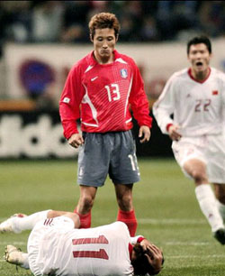
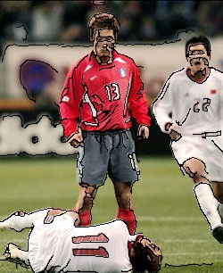
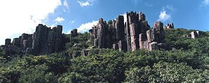
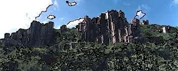

# CartoonMaker

## 프로그램 설명

CartoonEdgeRenderer는 OpenCV를 이용하여 입력된 이미지에 **만화 스타일(cartoon-like effect)**을 적용하는 간단한 이미지 처리 프로그램이입니다.  

이 프로그램은 원본 이미지의 색상과 해상도를 최대한 유지하면서 **강한 윤곽선(edge)**을 검출하여 이미지 위에 덧그리는 방식으로 만화와 비슷한 시각적 효과를 추가해줍니다.  

---

## 동작 방식

프로그램은 다음과 같은 단계를 수행합니다.

1. 입력 이미지 로드  
2. 그레이스케일 변환 및 블러 처리로 노이즈 감소  
3. Canny Edge Detection을 이용하여 이미지의 강한 윤곽선 검출  
4. Morphological operation으로 작은 잡선이나 노이즈 윤곽선을 제거  
5. 검출된 윤곽선을 원본 이미지 위에 검은 선으로 덧그려 만화 스타일 이미지 생성  

---

## 좋은 예시 (Good Examples)

다음과 같은 이미지에서 좋은 결과를 얻을 수 있습니다.

- 피규어, 장난감, 캐릭터 이미지  
- 배경이 단순한 인물 사진  
- 물체의 윤곽선이 뚜렷한 이미지  
- 대비(contrast)가 높은 이미지  

이러한 이미지들은 윤곽선이 명확하기 때문에 엣지 검출이 잘 이루어지고 만화 스타일 효과가 자연스럽게 나타납니다.

### Example

원본 이미지  

결과 이미지  

---

## 좋지 않은 예시 (Bad Examples)

다음과 같은 이미지에서는 결과가 좋지 않을 수 있습니다.

- 배경이 매우 복잡한 사진  
- 여러 인물이 겹쳐 있는 장면  
- 잔디, 나무, 군중 등 텍스처가 많은 이미지  
- 대비가 낮고 흐릿한 이미지  

결과 이미지  

---

## 한계점 (Limitations)

간단한 엣지 검출 기반 카툰 필터이기 때문에 다음과 같은 한계가 존재합니다.

- 실제 애니메이션이나 웹툰과 같은 고품질 스타일 변환은 수행하지 못한다.  
- 복잡한 배경에서는 불필요한 윤곽선이 많이 생성될 수 있다.  
- 이미지의 조명이나 대비에 따라 윤곽선 검출 성능이 달라질 수 있다.  
- 인물과 배경을 자동으로 정확하게 분리하지 못한다.

따라서 본 프로그램은 **간단한 만화 스타일 효과를 생성하는 데 목적이 있으며**, 복잡한 장면에서는 결과 품질이 제한될 수 있습니다.
